## 磁盘映像文件

## RAW

`RAW` 格式广义上指的是一种没有文件系统结构的原始数据存储格式，常用于直接读取和写入磁盘设备的物理扇区。这种格式非常适合数据恢复、虚拟化、嵌入式系统等场景。下面是 `RAW` 格式的详解，包括其原理、应用场景和使用方法。

创建RAW磁盘映像文件

qemu-img create -f raw /home/lyra/os/lyra-linux/image/disk1.img 100M

创建一个名称为disk1的100M大小的虚拟磁盘文件。

## 系统编译流程

编译流程:
1. 使用x86_64-linux-gnu-gcc命令将汇编文件编译输出.o文件，o文件是利用汇编器生成的目标程序。.o文件可以与其他.o文件链接一起最终输出可执行程序，例如汇编程序生成的.o文件与c语言生成的.o文件，使用链接器将它们链接在一起就能实现c语言调用汇编代码，汇编代码调用c语言了。
例：
```bash
 # 将汇编程序输出为目标程序
 x86_64-linux-gnu-gcc -m32 -g -c start.S -o start.o
```
2. 使用 x86_64-linux-gnu-ld链接器将目标程序进行链接并输出elf文件。-m参数用于指定输出文件指令架构,i386是Intel 32位; -Text表示将代码放置到0x7c00地址处;--section-start表示设置段的内存起始位置，与代码中的boot_end是保持一致的，a表示段会被分配到程序内存空间中，x表示代码可以被执行的。如下图所示:

   

```bash
x86_64-linux-gnu-ld start.o -m elf_i386  -Ttext=0x7c00  --section-start boot_end=0x7dfe -o ./boot.elf
```

3. elf文件虽然是二进制文件，但是它是一种结构化的二进制文件，包含了许多程序头、符号表信息，需要将elf文件转换为纯粹二进制文件才能被计算机进行加载。使用objcopy命令可以完成这个操作。

```bash
objcopy -O binary boot.elf  boot.bin
```

其他工具:

1. objdump: 将二进制文件进行反汇编。-x: 显示目标文件头信息; -d: 机器码与汇编文件对应操作; -S反汇编的同时输出源代码信息; -m 指定指令集.

```bash
objdump -x -d -S -m i8086 boot.elf 
```

2. x86_64-linux-gnu-readelf：用于查看elf文件的符号信息的,

使用这个命令可以知道文件的的相关信息，例如我们之前设置的_start段的地址0x7c00就可以利用readelf命令查询到。


```bash
x86_64-linux-gnu-readelf -a boot.elf 
```


## cmake配置

### 公共配置

用于配置项目的全局配置，例如cmake的版本，使用的编译器链接器等等

```cmake
# ----------------公共配置--------------------------------
# cmake最低版本
cmake_minimum_required(VERSION 3.28.3)

 # 开启输出编译详细过程的提示
set(CMAKE_VERBOSE_MAKEFILE on)  


# 项目配置
project(lyraLinux LANGUAGES C ASM)

# c语言编译器
set(CMAKE_C_COMPILER, "x86_64-linux-gnu-gcc")

# c语言编译器编译参数
set(CMAKE_C_FLAGS "-g -c -O0 -m32 -fno-pie -fno-stack-protector -fno-asynchronous-unwind-tables")
# 汇编器
set(CMAKE_ASM_COMPILER "x86_64-linux-gnu-gcc")
# 汇编器编译参数
set(CMAKE_ASM_FLAGS "-m32 -g")
# 汇编文件后缀
set(CMAKE_ASM_SOURCE_FILE_EXTENSIONS "s")


# 链接器
set(LINKER_TOOL "x86_64-linux-gnu-ld")

# 文件转换工具，用于将elf文件转换为标准二进制文件
set(OBJCOPY_TOOL "x86_64-linux-gnu-objcopy")
# 反汇编工具
set(OBJDUMP_TOOL "x86_64-linux-gnu-objdump")
# elf文件查看器，用户查看elf文件配置信息
set(READELF_TOOL "x86_64-linux-gnu-readelf")

include_directories(
)

# 底层的若干子项目：含内核及应用程序
add_subdirectory(./boot)
add_subdirectory(./loader)
```

### boot

boot项目的配置信息，例如编译后的结果要加载到内存的什么位置，链接器的参数什么，要编译哪些文件等等。

- ${CMAKE_SOURCE_DIR}：源文件根目录
- ${CMAKE_BINARY_DIR}: 构建结果跟目录
- 

```cmake
# ------------------------------boot工程配置------------------------------------
project(boot LANGUAGES C)

file(MAKE_DIRECTORY ${CMAKE_BINARY_DIR}/boot)

# 设置链接器配置信息
set(CMAKE_C_LINK_EXECUTABLE "${LINKER_TOOL} <OBJECTS> -m elf_i386  -Ttext=0x7c00  --section-start boot_end=0x7dfe -o boot/boot.elf")

# 设置要编译链接的文件列表
file(GLOB C_LIST "*.c" "*.h")
add_executable(${PROJECT_NAME} start.s ${C_LIST})

add_custom_command(TARGET ${PROJECT_NAME}
                   POST_BUILD
                   COMMAND ${OBJCOPY_TOOL} -O binary ${CMAKE_BINARY_DIR}/boot/boot.elf ${CMAKE_SOURCE_DIR}/image/boot.bin
                   COMMAND ${OBJDUMP_TOOL} -x -d -S -m i8086 ${CMAKE_BINARY_DIR}/boot/boot.elf > ${CMAKE_BINARY_DIR}/boot/boot_dis.txt
                   COMMAND ${READELF_TOOL} -a ${CMAKE_BINARY_DIR}/boot/boot.elf > ${CMAKE_BINARY_DIR}/boot/boot_elf.txt
)
```

### loader

将loader加载到0x8000内存中。

```cmake
project(loader LANGUAGES C)

# ------------------------------loader工程配置------------------------------------
file(MAKE_DIRECTORY ${CMAKE_BINARY_DIR}/loader)

set(CMAKE_C_FLAGS "${CMAKE_C_FLAGS} -O0")


# 设置链接器配置信息
set(CMAKE_C_LINK_EXECUTABLE "${LINKER_TOOL} <OBJECTS> -m elf_i386  -Ttext=0x8000  -o loader/loader.elf")

# 设置要编译链接的文件列表
file(GLOB C_LIST "*.c" "*.h" "${CMAKE_SOURCE_DIR}/common/*.h" "${CMAKE_SOURCE_DIR}/common/*.c")
add_executable(${PROJECT_NAME} start.s ${C_LIST})

include_directories(${CMAKE_SOURCE_DIR}/common)

add_custom_command(TARGET loader
                   POST_BUILD
                   COMMAND ${OBJCOPY_TOOL} -O binary ${CMAKE_BINARY_DIR}/loader/loader.elf ${CMAKE_SOURCE_DIR}/image/loader.bin
                   COMMAND ${OBJDUMP_TOOL} -x -d -S -m i8086 ${CMAKE_BINARY_DIR}/loader/loader.elf > ${CMAKE_BINARY_DIR}/loader/loader_dis.txt
                   COMMAND ${READELF_TOOL} -a ${CMAKE_BINARY_DIR}/loader/loader.elf > ${CMAKE_BINARY_DIR}/loader/loader_elf.txt
)
```


### vs code编译链配置

#### 写文件脚本

dd命令参数:

- if: 输入的文件路径
- of: 输出的文件路径
- bs: 块大小
- count: 读写块数
- seek: 跳指定块数

需要一个写入到磁盘映像的脚本，用于启动时将系统映像写入到磁盘中。脚本如下所示:

```bash
export PROJECT_HOME_PATH=/root/os/lyra-linux-os

export DISK1_NAME=$PROJECT_HOME_PATH/image/disk1.img
export BOOT_FILE_NAME=$PROJECT_HOME_PATH/image/boot.bin
export LOADER_FILE_NAME=$PROJECT_HOME_PATH/image/loader.bin


# 写boot区，定位到磁盘开头，写1个块：512字节
dd if=$BOOT_FILE_NAME of=$DISK1_NAME bs=512 conv=notrunc count=1

# 写loader区，定位到磁盘第2个块，写1个块：512字节
dd if=$LOADER_FILE_NAME of=$DISK1_NAME bs=512 conv=notrunc seek=1

```

#### qemu启动

需要有个脚本来启动qemu

参数:

- -daemonize: 后台运行qemu。

- -m: 内存大小

- -drive file=/,format=raw,index=0,media=disk, 磁盘映像文件路径以及磁盘映像格式IDE磁盘索引存储设备类型

- -s: 开启gbd调试模式

- -S: 启动虚拟机后暂停qemu的执行，等待gdb debug连接。

- -d: 虚拟机日志输出级别

  - `pcall`：记录 CPU 中断调用。

  - `page`：记录页面映射的相关事件。

  - `mmu`：记录内存管理单元（MMU）相关的事件。

  - `cpu_reset`：记录 CPU 重置事件。

  - `guest_errors`：记录虚拟机内核的错误信息。

  - `trace:ps2_keyboard_set_translation`：记录 PS/2 键盘翻译设置的跟踪信息。

    

```bash
export PROJECT_HOME_PATH=/root/os/lyra-linux-os

qemu-system-i386 -daemonize -m 128M -drive file=$PROJECT_HOME_PATH/image/disk1.img,format=raw,index=0,media=disk -s -S -d pcall,page,mmu,cpu_reset,guest_errors,page,trace:ps2_keyboard_set_translation
```

#### tasks.json

在tasks.json中配置可以在终端菜单中的运行任务中进行选择执行指定的任务，不用输入繁琐的命令。


- ${workspaceFolder}: 当前项目目录
- dependsOn: 执行调试准备前需要执行写镜像文件和启动qemu任务。
- sequence: 按顺序执行任务。

```json
{
    // See https://go.microsoft.com/fwlink/?LinkId=733558
    // for the documentation about the tasks.json format
    "version": "2.0.0",
    "tasks": [
        {
            "label": "写镜像文件",
            "type": "shell",
            "command": "bash ${workspaceFolder}/script/write-image.sh"
        },
        {
            "label": "启动qemu",
            "type": "shell",
            "command": "bash ${workspaceFolder}/script/qemu-debug.sh"
        },
        {
            "label": "调试准备",
            "type": "shell",
            "dependsOrder": "sequence",
            "dependsOn": [
                "写镜像文件",
                "启动qemu"
            ]
        },
    ]
}
```

launch.json

用于配置debug调试环境配置信息

```json
{
    // 使用 IntelliSense 了解相关属性。 
    // 悬停以查看现有属性的描述。
    // 欲了解更多信息，请访问: https://go.microsoft.com/fwlink/?linkid=830387
    "version": "0.2.0",
    "configurations": [
        {
            // 配置名称
            "name": "gdb debug",
            // debug类型
            "type": "cppdbg",
            // 调试请求类型"launch"（启动调试）或 "attach"（附加到已运行的进程）
            "request": "launch",
            // 指定要调试的程序路径
            "program": "${workspaceRoot}/build/boot/boot.elf",
            // 工作目录
            "cwd": "${workspaceRoot}",
            // 外部控制台运行程序
            "externalConsole": false,
            // debug开始前是否需要暂停
            "stopAtEntry": false,
            // 调试器
            "MIMode": "gdb",
            // 调试器路径
            "miDebuggerPath": "/usr/bin/gdb",
            // gdb debug远程端口以及地址信息
            "miDebuggerServerAddress": "127.0.0.1:1234",
            // 远程机器架构
            // "targetArchitecture": "x86"
            // 链接器链接后停止
            "stopAtConnect": true,
            // GDB启动参数
            "setupCommands": [
                {
                    "description": "为 gdb 启用整齐打印",
                    "text": "-enable-pretty-printing",
                    "ignoreFailures": true
                },
                {
                    "description": "将反汇编风格设置为 Intel",
                    "text": "-gdb-set disassembly-flavor intel",
                    "ignoreFailures": true
                },
            ],
            "linux": {
                "preLaunchTask": "调试准备", // 仅在windows下可自动运行
                "miDebuggerPath": "gdb", // linux下的特殊配置
            },
            // 加载符号文件便于debug时展示汇编指令与c语言代码的映射关系
            "postRemoteConnectCommands": [
                {
                    "description": "加载boot符号文件",
                    "text": "-file-symbol-file ./build/boot/boot.elf",
                    "ignoreFailures": false
                },
                {
                    "description": "加载loader符号文件",
                    "text": "-file-symbol-file ./build/loader/loader.elf",
                    "ignoreFailures": false
                },
                {
                    "description": "运行至0x7c00",
                    "text": "-exec-until *0x7c00",
                    "ignoreFailures": false
                },
            ]
        }
    ]
}
```

## GCC内联汇编

基本语法格式如下所示:

```c
asm [ volatile ] (  
         assembler template                    /* 汇编语句 */
         [ : output operands ]                /* 输出操作数 */
         [ : input operands  ]                /* 输入操作数 */
         [ : list of clobbered registers ]    /* 修改列表，汇编代码对哪些寄存器或内存发生了改变，便于GCC根据行为生成正确的汇编代码 */
         );
```

输入输出的内容表示可选项。

| 字母       | 含义                                             |
| ---------- | ------------------------------------------------ |
| m, v, o    | 内存单元                                         |
| R          | 任何通用寄存器                                   |
| Q          | 寄存器eax, ebx, ecx,edx之一                      |
| I, h       | 直接操作数                                       |
| E, F       | 浮点数                                           |
| G          | 任意                                             |
| a, b, c, d | 寄存器eax/ax/al, ebx/bx/bl, ecx/cx/cl或edx/dx/dl |
| S, D       | 寄存器esi或edi                                   |
| I          | 常数（0～31）                                    |

如下例子所示，将调用0x15号中断，在输出语句中定义了将eax的值保存到signature变量中，将ebx的值保存到contId变量中，将ecx的值保存到bytes变量中，并在输入语句中定义了，将eax的值设置成0xe820，将ecx的值设置成24，将ebx的值设置成contId，将edx的值设置成的值设置成0x534d4150，将edx的值设置成point_entry指针，最后该指令会对内存进行修改。

```c
asm("int $0x15" : "=a"(signature), "=b"(contId), "=c"(bytes)
     : "a"(0xe820), "c"(24), "b"(contId), "d"(0x534d4150), "D"(point_entry)
     : "memory");
```

如下例子所示 ，该汇编语言没有输出，在汇编指令中*(%[a])表示间接寻址，读取eax寄存器存储的数据作为地址，来进行ljmpl远跳，在设置输入参数时[a] "r"(addr)，会将addr变量的地址传入到eax寄存器中。

```c
 asm("ljmpl *(%[a])" ::[a] "r"(addr));
```

如果指令使用了寄存器的话，必须得多加个%号，避免与Intel汇编命名冲突，如下所示:

```c
asm("mov %%cr0, %%eax" : "=a"(rv));
```


## 操作系统

### 系统执行流程

1. BOOT: 加载loader程序。
2. LOADER: 读取内存信息，设置系统配置，加载kernel程序。
3. kernel: 执行我们的操作系统。


### BOOT

计算机引导流程:

- 通电

  按下开机键，CPU会从ROM中读取BIOS系统并加载到内存中。

- 执行BIOS程序

  加载完成后会执行BIOS程序。

- BIOS自检

  在BIOS执行过程中会对计算机硬件进行自检避免运行出错

- 运行引导代码

  之后会读取硬盘扇区末尾为0x55aa的扇区并加载到内存0x7c00中，一个扇区大小为512字节。我们的操作系统512字节肯定是不够用的，所以我们需要利用这个512字节读取我们的操作系统并加载到内存中。

- 进入操作系统

  执行我们的操作系统的代码。


如下图所示，灰色部分表示我们可以正常使用的区域,0x400~0x7c00表示我们的栈区域。0x7c00-0x7e00表示我们的boot程序。


```assembly
    #include "boot.h"
    .code16
    .text
    .global _start
    // 标识.extern才能调用c语言函数
    .extern boot_entry

_start:
    // 初始化寄存器配置 将寄存器设置为0，并将栈底指针设置为0x7c00, 0x500-0x7c00表示我们的栈存储区域, 0x400-0x4ff是bios数据存储区
    mov $0, %ax
    mov %ax, %ds
    mov %ax, %ss
    mov %ax, %es
    mov %ax, %fs
    mov %ax, %gs
    mov $0x7c00, %esp

    // 读取loader分区信息
    mov $0x8000, %bx
    mov $0x2, %ah
    mov $0x2, %cx
    mov $64, %al
    mov $0x0080, %dx
    int $0x13

    jmp boot_entry

.section boot_end, "ax"
boot_sig: .byte 0x55, 0xaa
```


### loader

loader模块需要完成以下几个功能:

- 获取硬件基本信息

- 初始化系统配置
- 进入保护模式
- 加载kernel到内存中


#### 初始化系统配置

##### 内存检查

参考文档: `https://wiki.osdev.org/Detecting_Memory_(x86)`

检测内存使用的是0x15号中断 0xe820功能号，e820目前是唯一一种方式可以检测到4G以上内存信息的方法。

首先我们需要定义一个结构体用于存储内存配置信息，e820_entry结构体中定义了e820读取内存信息后写入内存的结构。

```c
typedef struct e820_entry
{
    unint32_t base_addr_l; // 基地址，表示该内存区域的起始地址
    unint32_t base_addr_h; // 基地址，表示该内存区域的起始地址
    unint32_t length_l;    // 长度，表示该内存区域的大小
    unint32_t length_h;    // 长度，表示该内存区域的大小
    unint32_t type;        // 类型，表示该内存区域的用途或类型 0x01表示可用内存 0x02表示保留区域 0x03表示ACPI保留内存区域,0x04表示不可用内存区域
    unint32_t acpi;        // ACPI扩展字段（可选）
} e820_entry;

#include "types.h"

#define BOOT_RAM_REGION_MAX 10

// 内存信息结构体
typedef struct boot_info_t
{
    struct
    {
        unint32_t start;
        unint32_t size;
    } ram_regin_confg[BOOT_RAM_REGION_MAX];

    int ram_region_count;
} boot_info_t;

```

int 0x15 e820具体指令格式如下所示:

输入:

eax: 0xe820 功能码 

ebx: 内存执行区域，第一次调用时等于0。

es : di: 将e820_entry结果写入内存区域处

ecx: e820_entry结构体大小，通常是无效的，无论设置成什么BIOS 始终会填充20个字节的entry信息。

edx: 传入字符串 `'SMAP'`（ASCII 码：53 4D 41 50），用于验证支持性。

输出:

CF: 无错误0 有错误1

eax: 字符串 `'SMAP'`（ASCII 码：53 4D 41 50），用于验证支持性。

ebx: 执行下一个内存区域，当输出等于0时表示内存 读取完成。

es : di: 将e820_entry结果写入内存区域处

ecx: 读取entry长度数。

```c
static void detect_memory(void)
{
    e820_entry entry;

    show_msg("try to detect memory:");
    boot_info.ram_region_count = 0;

    int contId = 0;
    int signature = 0;
    int bytes = 0;

    for (int i = 0; i < BOOT_RAM_REGION_MAX; i++)
    {
        e820_entry *point_entry = &entry;
        asm("int $0x15" : "=a"(signature), "=b"(contId), "=c"(bytes)
            : "a"(0xe820), "c"(24), "b"(contId), "d"(0x534d4150), "D"(point_entry)
            : "memory");

        // 如果signature不等于0x534D4150那么表示计算机硬件不支持e820方式读取内存信息
        if (signature != 0x534D4150)
        {
            show_msg("signature error");
            break;
        }

        //  acpi校验 osdev也没有写为什么要加这个代码，具体作用也不知道是做什么的
        if (bytes > 20 && (point_entry->acpi & 0x0001) == 0)
        {
            continue;
        }

        // type等于1表示可用内存 保存可以内存信息到结构体中
        if (point_entry->type == 1)
        {
            boot_info.ram_regin_confg[boot_info.ram_region_count].start = entry.base_addr_l;
            boot_info.ram_regin_confg[boot_info.ram_region_count].size = entry.length_l;
            boot_info.ram_region_count++;
        }

        // contId = 0表示内存读取完毕
        if (contId == 0)
        {
            break;
        }
    }

    show_msg("memeory read done.");
}
```

跑一下程序，等待内存读取完成后查看一下boot_info中是否可以正常的读取到内存信息，我们的qemu设置的字节大小是128M，133038080刚好等于127.34，应该是抛去了不可用的内存信息:

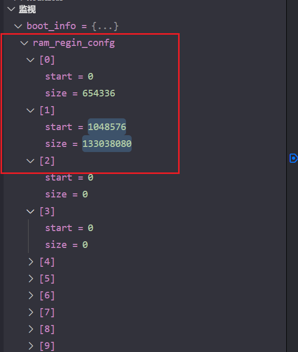

#### 保护模式

保护模式的流程如下所示:

- 关中断，在切换保护模式时进制有其他中断打断。
- 开启A20地址线，使计算机可以访问32位地址。
- 加载GDT表项
- 设置cr0以启用保护模式
- 远眺清空实模式流水线

##### 关中断

首先得将关中断打开，避免在切换保护模式的时候被其他程序打断，最后出现不可预料的后果。

关中断倒是挺简单，指定cli命令就可以关中断，使用内联汇编即可。

```assembly
static inline void cli(void)
{
    // 关中断
    asm("cli");
}
```

##### 设置A20地址线

在8086处理器中，最大访存空间为1M，只有打开A20地址线才能访问1M以上的内存空间。

设置地址线也挺简单的，将0x92端口的第二位设置成1即可。

```c
 
// 开启A20地址线 读取端口信息后将第二位设置成1并写回到端口中
    uint16_t port = (uint16_t)0x92;
    unit8_t value = inb(port);
    outb(0x92, (value | 0x2));
```

##### 加载GDT表项

这一部分就比较复杂了，GDT的各种配置项，基地址，这里先不设计GDT的配置，后面有章节会将具体的GDT应该要怎么配置。

首先定义一下GDT表现信息:

```c
uint16_t gdt_table[][4] = {
    {0, 0, 0, 0},
    {0xffff, 0x0000, 0x9a00, 0x00cf},
    {0xffff, 0x0000, 0x9200, 0x00cf}};

```

然后使用lgdt加载表项信息

lgdt总共48位，其中limit有16位，代表GDT表项数，剩余32位则是GDT段基址。

```
static inline void lgdt(unint32_t start, uint16_t size)
{
    struct
    {
        uint16_t limit;
        uint16_t start_l;
        uint16_t statt_h;
    } gdt;

    gdt.statt_h = start >> 16;
    gdt.start_l = start & 0xffff;
    gdt.limit = size;

    asm("lgdt %[g]" ::[g] "m"(gdt));
}
```

```c
    lgdt((unint32_t)gdt_table, sizeof(gdt_table));
```

在gdt结构体中使用两个uint16_t而不是一个unint32_t的原因是，unint32_t使用的是typedef unsigned long unint32_t;根据操作系统的不同unsigned long 如果是在32位系统上占用的是4字节，而在64位系统中使用的是8字节，而gdtr长度是6个字节，如果unsigned long占用8个字节的话，那么在加载gdt表时会出错。

##### 设置CR0寄存器

打开CR0表示操作系统已经进入到保护模式中。

和A20地址线类似，读取到cr0寄存器后将第一位设置成1再写回即可。

```c
static inline unint32_t read_cr0()
{
    unint32_t rv;
    asm("mov %%cr0, %%eax" : "=a"(rv));

    return rv;
}
```

```c
    // 设置cr0
    unint32_t cr0 = read_cr0();
    cr0 = cr0 | 0x1;
    write_cr0(cr0);
```

##### 远跳1M以上内存,清空流水线

远跳需要设置段选择子，这里也没有详细讲到，等后面章节将保护模式中会有讲解。

```c
// 地址跳转
static inline void far_jump(unint32_t selector, unint32_t offset)
{
    unint32_t addr[] = {offset, selector};
    asm("ljmpl *(%[a])" ::[a] "r"(addr));
}
```

```c
    // 0x08 是代码段选择子 远跳转清空流水线
    far_jump((unint32_t)8, (unint32_t)protected_mode_entry);
```

protected_mode_entry在start.s汇编语言源文件中有定义，.code32表示将后面的预计内容编译成32位的机器码，然后使用  .global protected_mode_entry将该函数进行导出便于在c语言文件中进行使用。


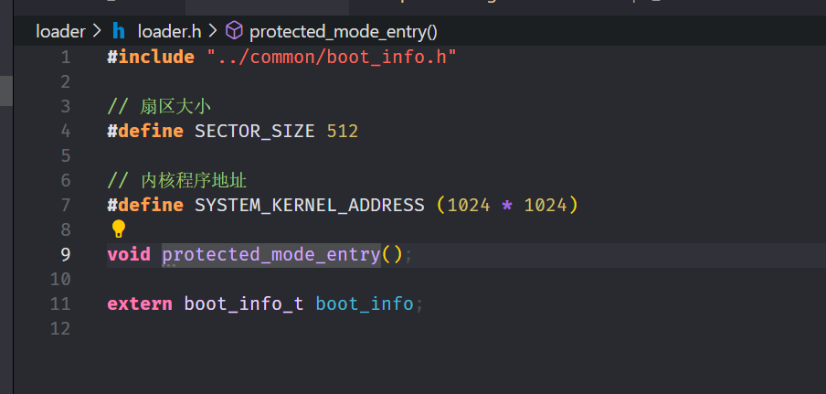


#### 加载kernel

ATA模式可以读取SATA硬盘和IDE硬盘
硬盘接口分为 SATA、IDE、M.2，ATA模式可以读取SATA、IDE接口的硬盘，无法读取ATA模式的硬盘。

IDE接口有两个通道，一个主通道，一个从通道，每个通道都可以连接2块硬盘，2个通道可以连接4块硬盘。

IDE接口如下所示:


LBA48读取硬盘参考文档: https://wiki.osdev.org/ATA_PIO_Mode

写寄存器: 

| 寄存器       | 端口  | 作用                               |
| ------------ | ----- | ---------------------------------- |
| device寄存器 | 0x1f6 | 参数取值下表所示                   |
| 读取扇区数   | 0x1f2 | 读取扇区数，需要设置两次，每次24位 |
| lba1参数     | 0x1f3 | LBA参数，需要设置两次，每次8位     |
| lba2参数     | 0x1f4 | LBA参数，需要设置两次，每次8位     |
| lba3参数     | 0x1f5 | LBA参数，需要设置两次，每次8位     |
| lba4参数     | 0x1f6 | LBA参数，需要设置两次，每次8位     |

0x1f6取值: 

| **位号** | **值** | **描述**                                                     |
| :------- | :----- | :----------------------------------------------------------- |
| 7        | 1      | 固定为 1，用于标识寄存器操作。                               |
| 6        | 1      | 选择主盘（Device 0）。                                       |
| 5        | 1      | 启用 LBA 地址模式（1 表示 LBA，0 表示 CHS 模式）。           |
| 4        | 0      | 保留位，固定为 0。                                           |
| 3:0      | 0000   | LBA 地址的高 4 位（LBA 27:24），此处为 `0000`，表示地址高 4 位为 0 |

读寄存器:

| 寄存器   | 端口  | 作用               |
| -------- | ----- | ------------------ |
| 设备状态 | 0x1f7 | 获取设备的状态信息 |

| 位 (Bit) | 名称                  | 含义                                                         |
| :------- | :-------------------- | :----------------------------------------------------------- |
| 7        | BSY (Busy)            | 当 BSY 位为 1 时，表示设备正忙，其他位可能无效，控制器不能接受新的命令。 |
| 6        | DRDY (Drive Ready)    | 设备准备好位。为 1 表示设备已经准备好，可以接受命令。通常在 BSY 为 0 时有效。 |
| 5        | DF (Device Fault)     | 设备故障标志。为 1 表示设备发生了故障。                      |
| 4        | SRST (Soft Reset)     | 软复位标志。为 1 表示设备处于复位状态。                      |
| 3        | DRQ (Data Request)    | 数据请求标志。为 1 表示设备准备好传输数据，通常用于数据传输阶段。 |
| 2        | CORR (Corrected Data) | 数据纠正标志。为 1 表示设备已经纠正数据错误。                |
| 1        | IDX (Index)           | 此位通常没有使用，保留值。                                   |
| 0        | ERR (Error)           | 错误标志。为 1 表示在前一个命令执行期间发生了错误。          |

```c
/*
 LBA48，最高可以读取48位256TB，读取磁盘
 sector: 开始扇区
 selctor_count: 读扇区数
 buffer: 保存缓冲区地址
*/
static void read_disk(unint32_t sector, uint16_t selctor_count, unit8_t *buffer)
{
    // 设置硬盘读取位置 具体查看0x1f6寄存器位配置表
    outb(0x1f6, 0xe0);
    // 设置读取扇区数量高8字节
    outb(0x1f2, selctor_count >> 8);
    /*
        LBA48扇区读写位
        LBA4  24-31
        LBA5  32 - 39
        LBA6 40 - 47
        LBA1 0-7
        LBA2 8-15
        LBA3 16-23
    */
    unit8_t lba4 = (sector >> 24) & 0xff;
    // 函数的传参只有32位，所有lba5和lba6都是0
    unit8_t lba5 = 0;
    unit8_t lba6 = 0;
    
    unit8_t lba1 = sector & 0xff;
    unit8_t lba2 = (sector >> 8) & 0xff;
    unit8_t lba3 = (sector >> 16) & 0xff;

    outb(0x1f3, lba4);
    outb(0x1f4, lba5);
    outb(0x1f5, lba6);

    // 读取扇区低8位
    outb(0x1f2, selctor_count & 0xff);
    outb(0x1f3, lba1);
    outb(0x1f4, lba2);
    outb(0x1f5, lba3);

    outb(0x1f7, 0x24);

    uint16_t *data_buffer = (uint16_t *)buffer;
    while (selctor_count--)
    {
        // 判断硬盘是否在忙且准备好了数据，如果在忙则阻塞等待
        while ((inb(0x1f7) & 0x88) != 0x8)
        {
        }

        for (int i = 0; i < SECTOR_SIZE / 2; i++)
        {
            *data_buffer++ = inw(0x1f0);
        }
    }
}

```

#### 向内核传递启动信息

向内核传递信息有两中方式：

1. 直接将启动信息写入到固定内存中，然后kernel直接读固定位置内存即可，缺点是如果内存发生改变了，那么整个项目都得统一修改。
2. 函数传参，将启动信息以函数传参的方式传递到kernel内核中。

我们使用的是第二种方式，第二种方式需要了解x86函数调用的原理。

```c
void a(int a, int b)
{
    int c = a + b;
}

void loader_entry()
{
    a(20, 12);
}

```

例如上述代码中将20和12参数传入到函数a中，查看汇编语言如下所示:

在进行函数调用时，先将两个参数20和12压入到栈中，0xc是12，0x14是20，然后再利用call指令调用函数体，如下所示:

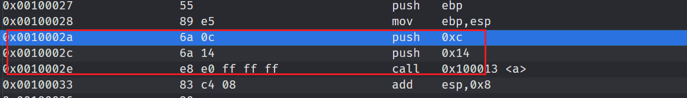

进入函数体中，先将栈顶指针保存一下，便于函数调用后进行恢复到之前的执行的语句中push ebp的作用就是这个作用，之后将栈顶指针设置到栈基址指针ebp中

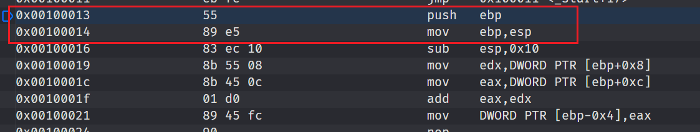

之后将esp减10以便于获取传入参数信息，因为12是4位，20是6位，共十位，之后利用栈顶指针加指定偏移就能获取到传入的参数了，0x8是8位，0x0c是16位。

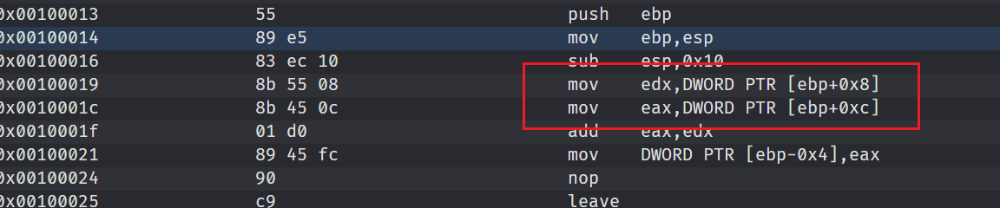

我们可以模仿以上流程将loader中的传参以c语言的方式传入到函数中，再传到kernel的汇编语言中，然后再由kernel的start.s的汇编语言中，再由start.s压栈传入到kernel.c函数中。

首先在loader中将boot_info进行传参。

```c
    ((void (*)(boot_info_t *))0x100000)(&boot_info);
```

在start.s中将loader传入的参数出栈并将地址信息保存到eax寄存器中

```assembly
.text
.global _start
.extern kernel_init
_start:
    // 模拟函数调用, 先将loader传入的值获取到保存到eax中, 再将eax压到栈中便于kernel_init函数获取到
    // 具体原理查看gcc c语言汇编调用原理
    push %ebp
    mov %ebp, %esp
    mov -0x18(%esp), %eax
    
```

之后再将eax压栈，便于函数获取到寄存器的值

```c
    // 压栈 由kernel_init出栈获取到参数
    push %eax
    call kernel_init
```

这样一来在kernel.c中就能获取到start.s中传过来的参数了

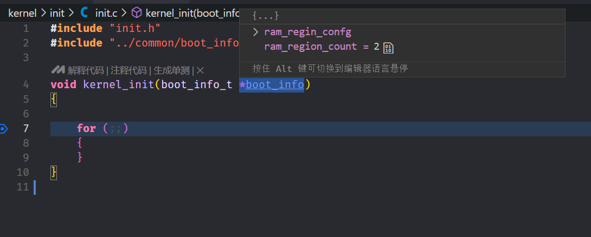

### elf文件

```txt
  [ 1] .text             PROGBITS        00008000 001000 00053d 00  AX  0   0  1
  [ 2] .rodata           PROGBITS        00009000 002000 00004c 00   A  0   0  1
  [ 3] .data             PROGBITS        0000a04c 00204c 000018 00  WA  0   0  4
  [ 4] .bss              NOBITS          0000a080 002064 000054 00  WA  0   0 32
```

.text: 放置代码和指令信息。

.rodata: 放置常量数据以及字符串信息。

.data: 存储全局变量、初始化的数据和静态的变量。

.bss: 存储未初始化的数据。

stack: 存储局部变量

``` lds
SECTIONS {
    . = 0x100000; /*设置段起始地址*/
    .text : {
        *(.text)
    }
    
    .rodata : {
        *(.rodata)
    }
    
    .data : {
        *(.data)
    }
    .bss : {
        *(.bss)
    }

}
```

### GDT

x86系统架构，分为两种，无论是分段存储还是分页存储，想要访问内存必须得有段描述符GDT，图1是分段存储，图2是分页存储。

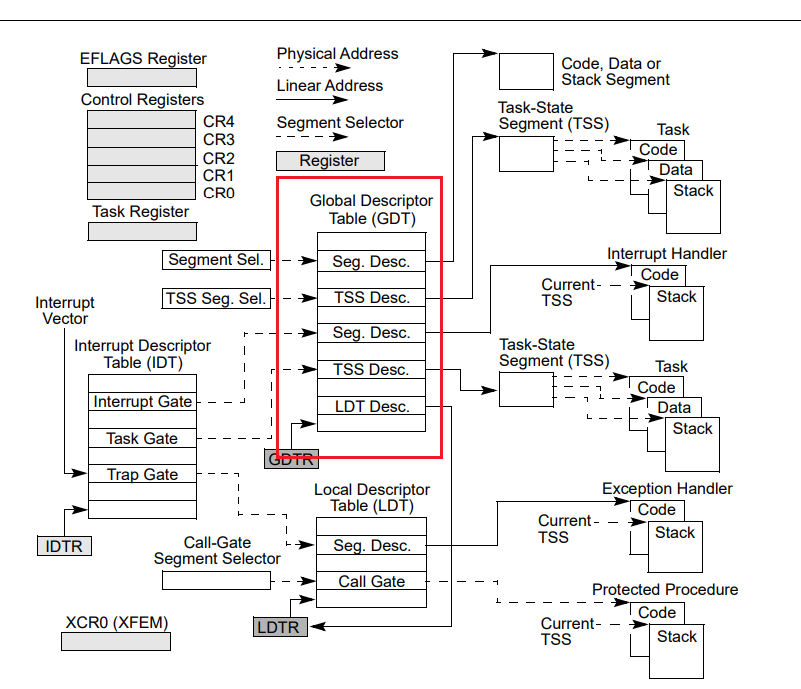

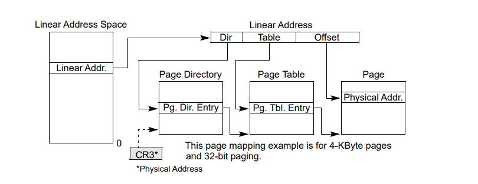

在保护模式中如果想要访问内存必须通过GDT段描述符才能进行访问，GDT的格式如下所示:

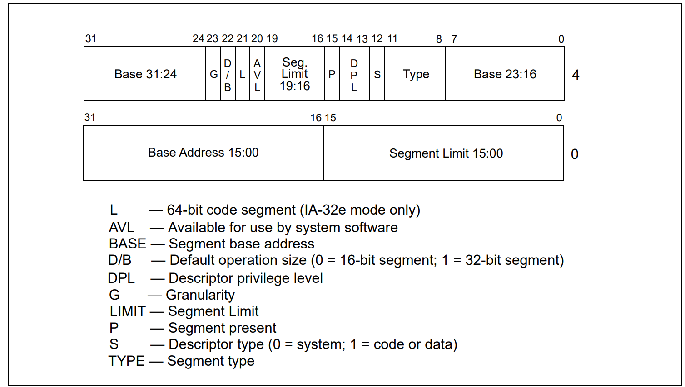

BASE: 段基址，段开始的地址。

LIMIT: 段界限，段最大访问界限。

P: 段有效位，1表示该段有效。

DPL: CPU特权级别，0表示最高权限。3表示最低权限。

S: 段描述符类型, 1表示系统段 1表示代码或数据段

TYPE: 段类型，第一位可执行位，如果为1表示可执行代码段，如果为0则是不可执行的数据段。第二位的取值是根据第一位来决定的，如果段是代码段的话，该位如果是0的话表示地址是从低到高增长的，一般默认是0即可，如果是1则是数据段是从高到低增长的，例如栈内存。如果该段是代码段的话，该位如果是0，那么该段只能与DPL位匹配的权限才能执行，如果该位是1的话，代码只要等于或小于DPL的权限就能执行。第三位是读写位，也分为两种情况，如果是数据段的话，该位如果是0，那么只允许读不允许写，如果是1则是允许读写，如果是代码段的话，如果是0那么表示只能读内存，不能进行内存写入操作，如果是1表示可以进行读写操作。最后一位表示访问位，如果CPU在访问该段时会设置成1。


G: 粒度。如果是0的话，limit单位为字节，如果是1的话，limit的单位则是4kb。

D/B: size标识，如果是0则标识该段是16位保护模式的段，如果是1则是32位保护模式的段。保护模式分为两种，一种是16位的保护模式，一种是32位的保护模式。一般使用的都是32位保护模式，将该位设置成1即可。

L: 用于标识该段是否支持长模式，也就是64位代码段。32位模式设置成0，64位模式设置成1即可。


### 保护模式下的内存管理

#### 分段存储

将内存空间分成多个段，按段来访问内存，每个段都有段的起始地址、段大小、段属性。通过段选择子+偏移得出真实的线性地址。在分段存储中，段与段之间的代码、数据和堆栈是相互隔离互不影响的。如下图所示，左边是分段 右边是分页，在分段区域中，cpu将线性地址按段分成多块，然后利用段选择子+偏移找到要执行的下一条指令进行执行。在分段中访问内存时先根据段选择子找到GDT表项，根据GDT表项找到段基址，段基址+偏移就可以找到下一条要执行的指令了，在执行的过程中会鉴权。


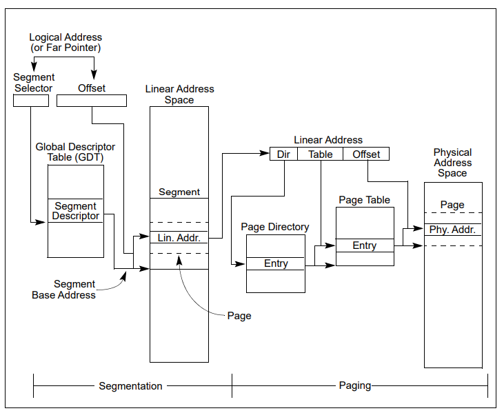

每个段寄存器都会有一个段选择子，以此来确定当前段可以访问哪些内存，访问的权限是什么，如下图是多段模型(Multi-Segment Model)，cs ss ds es fs都指向了一个唯一的段描述符，而根据段描述符就知道了当前段可以访问哪一部分内存区域，然后访问的权限是什么，通过这些段，可以实现内存分离和保护，如果程序在运行的过程中对一个对一个只允许读不允许写的段内存进行写操作，cpu会对该行为进行鉴权，不通过不予执行。

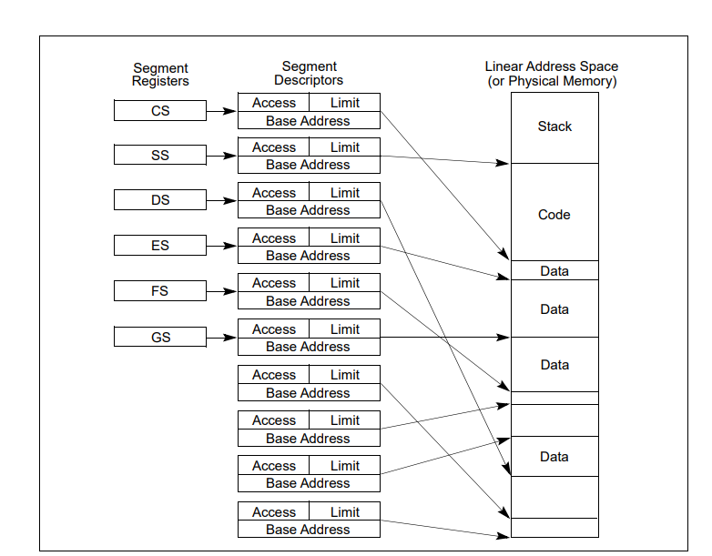

多段模型比较复杂一些，一般用的比较少，Linux和Windows用的都是平坦模型，而平坦模型又分为两种，第一种是简单的平坦模型，简单的平坦模型之后新建两个段，分别是数据段和代码段，寄存器通过访问者两个段来实现对内存的访问。这两个段的起始地址都是从0开始，可以访问全部的4GB的内存，如果访问的内存超过物理内存范围的地址可能会导致访问无效的内存区域会出现异常。

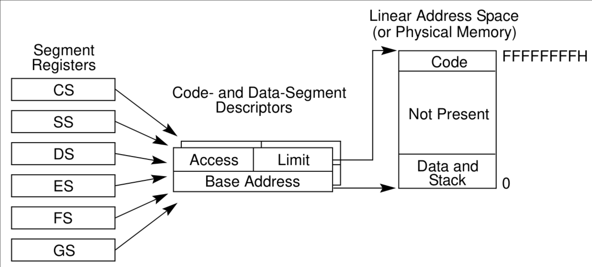

一下是受保护的平坦模型,添加了一些简单的限制，将数据段和代码段分割开，代码段和数据段只能访问它们独自的内存空间，互不干扰。	

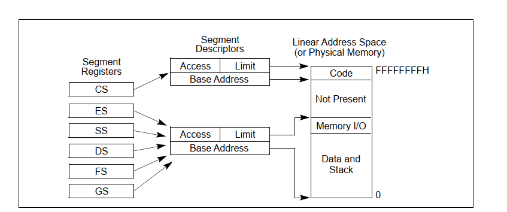

#### 分页存储


如果出现了异常，可以去栈中查看寄存器地址来找到错误码，最终来找到问题所在。

优先查看文开发文档来写代码，不然可能结构体会漏掉成员变量
牛魔的，代码要一点一点调试才能找出bug，一个代码段跳到另一个代码段，没输出东西导致我以为一致是第一个代码段的问题。