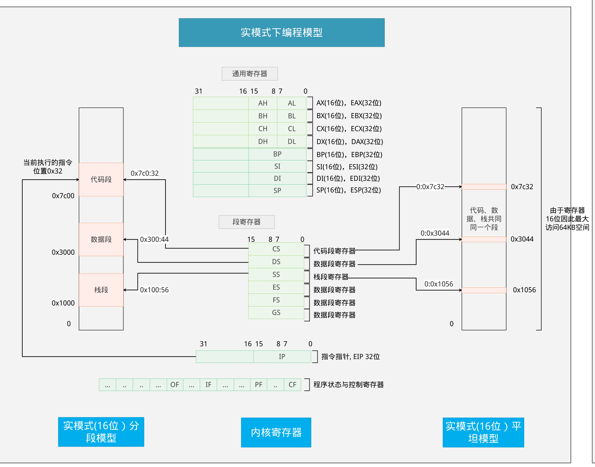
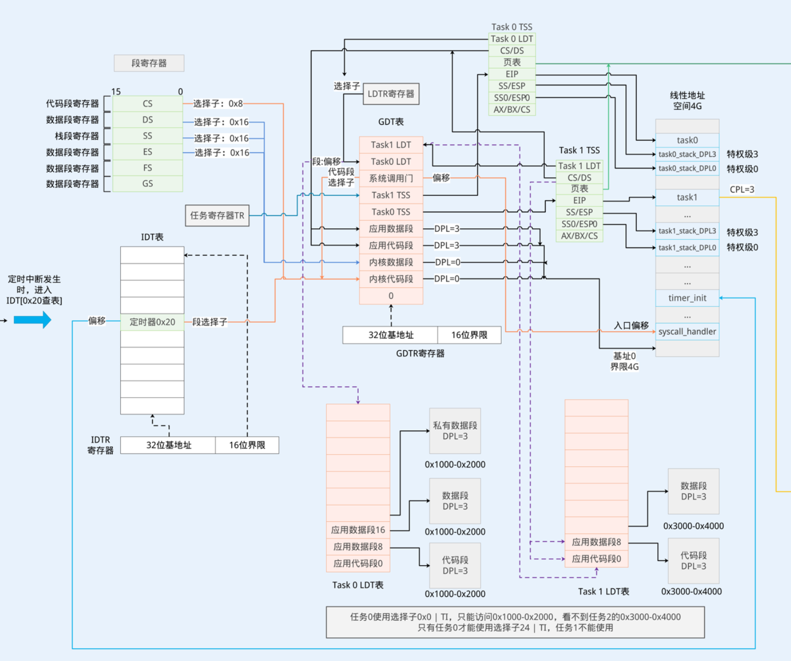
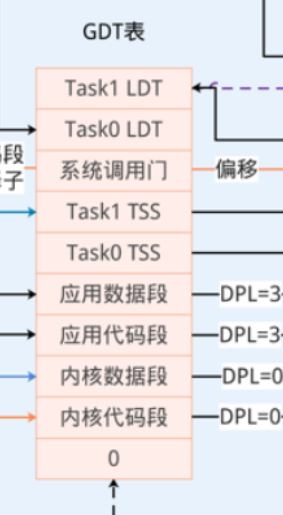
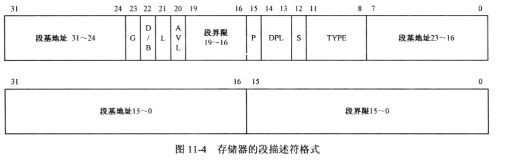
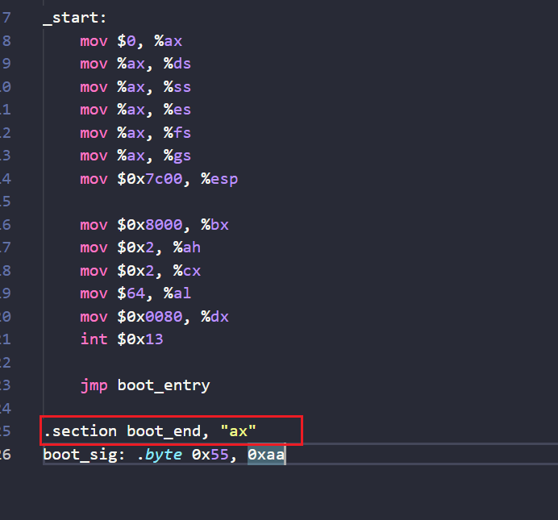
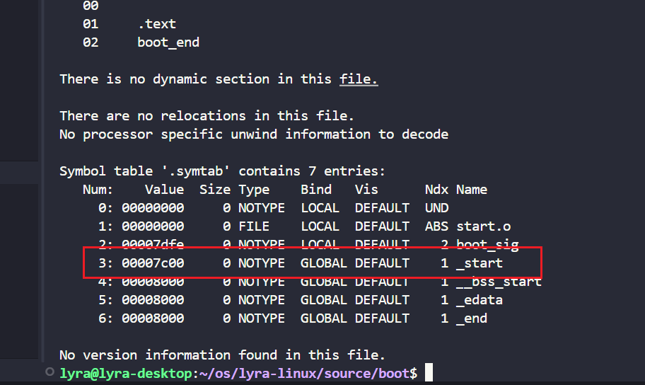
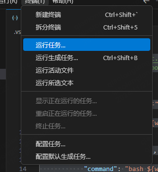
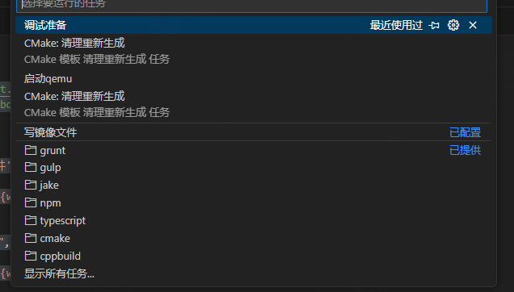
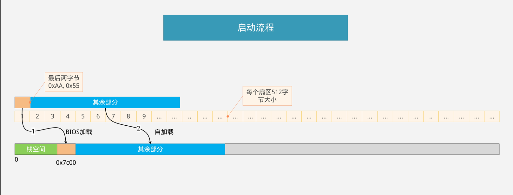
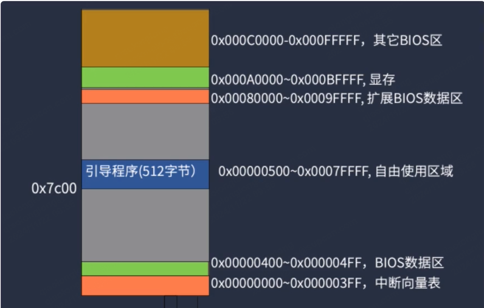

## 保护模式


### x86处理器编程模型

通用寄存器大多数都可以混着用的

通用寄存器: 

**EAX**：累加器寄存器，用于算术和逻辑运算。

**EBX**：基址寄存器，通常用于基址寻址。

**ECX**：计数器寄存器，通常用于循环计数。

**EDX**：数据寄存器，用于 I/O 操作和扩展乘法除法运算。

**ESI**：源索引寄存器，通常用于指向数据源。

**EDI**：目的索引寄存器，通常用于指向数据目的。

**EBP**：基址指针寄存器，通常用于栈操作。

**ESP**：栈指针寄存器，指向栈的顶部。

段寄存器寻址: 段基址 << 4 + 偏移	

段寄存器: 

1. **CS（代码段寄存器，Code Segment Register）**

- **功能**：CS 存储当前代码段的基址，指向正在执行的代码段。所有指令都是通过 CS 来定位其在内存中的物理地址。
- **用途**：当 CPU 执行指令时，CS 中的值与 EIP（指令指针寄存器）配合使用来确定下一条指令的物理地址。

2. **DS（数据段寄存器，Data Segment Register）**

- **功能**：DS 存储当前数据段的基址，指向数据存储的内存段。
- **用途**：所有数据操作，除非另有指定，默认都通过 DS 来定位数据的物理地址。

3. **SS（堆栈段寄存器，Stack Segment Register）**

- **功能**：SS 指向堆栈段的基址，管理堆栈操作。
- **用途**：堆栈操作（如 PUSH 和 POP 操作）使用 SS 和 ESP（栈指针寄存器）来确定堆栈在内存中的位置。

4. **ES（额外段寄存器，Extra Segment Register）**

- **功能**：ES 是一个额外的段寄存器，通常在字符串操作指令中与 EDI（目的索引寄存器）配合使用。
- **用途**：在执行字符串复制指令（如 `MOVS`）时，ES 通常用于指向目标内存段。

5. **FS（附加段寄存器，Additional Segment Register）**

- **功能**：FS 是一个额外的段寄存器，通常用于存储特殊数据结构的基址，如线程本地存储（Thread Local Storage, TLS）。
- **用途**：FS 可用于高级操作系统结构，或是为了提供额外的段访问。

6. **GS（全局段寄存器，Global Segment Register）**

- **功能**：GS 是另一个附加段寄存器，类似于 FS，但通常在不同场合下使用。
- **用途**：GS 也可以用于存储特殊数据结构的基址，或为操作系统提供扩展段访问。



在保护模式案例中64K内存空间足够使用了，所以所有段寄存器的值都设置成0即可。


### 加载其余部分

调用BIOS中断0x13就可以读取硬盘数据到内存中

**AH**: 设置为 `02h` 来读取扇区。

**AL**: 要读取的扇区数量（最多可以为 `FFh`，即 255）。

**CH**: 磁头的柱面号（Cylinder）。

**CL**: 扇区号（Sector），范围从 `01h` 到 `3Fh`。

**DH**: 磁头号（Head）。

**BX**: 指向存储数据的缓冲区的段:偏移地址。

```assembly

read_disk_all:
    ; 从0x7e00开始读, 0x7c00 + 512引导扇区 = 0x7e00
	mov $0x7e00, %bx
	mov $0x02	, %cx
	; 读取64个扇区
	mov $0x240, %ax
	mov $0x80, %dx
	int $0x13
	jc read_disk_all
```


### 保护模式

实模式是直接根据数据段和代码段寄存器来访问指定内存区域，所有的程序都可以修改段寄存器来访问内存中的任意区域，这样会使系统安全性降低，没有任何限制。

在保护模式中，程序访问内存数据时会校验权限以及是否越界，这样就会过滤掉恶意代码对计算机操作系统进行修改。

保护模式编程模型如下图所示:



在实模式中寻址方式是根据段基地址:偏移来进行寻址的，而保护模式是根据段寄存器中保存的段下标找到GDT段信息，在段信息中有段的起始地址以及权限信息，然后根据段信息再进行寻址访问的。






16位段属性，access_right的高四位表示扩展访问权限：

- G: 段界限为20位。如果为0时以字节方式寻址，段的寻址范围1B-1M; 如果为1则是以4k为单位寻址，段的寻址访问为4k-4G。一般32位模式设置成1，很明显，1M根本不够日常使用的。
- D/B: 默认操作数大小, 为1表示按32位寻址，为0表示16位寻址，16位一般用于80286的CPU中，其他基本都是使用32位的寻址方式。
- L: 64位代码标识，保留给64位处理器使用。
- AVL: 自定义标志位，用于开发人员自定义或扩展。
低8位:
- P: 如果为1表示该段存在，可以正常访问，如果为0表示该段不存在，强行访问会出现异常。
- DPL: 特权级, 分为4个特权级, 0 - 3,  0权限为最高，3为最低。
- S: 0表示系统段，1表示代码段。
- TYPE: 段的访问权限。
  x = 0时不可执行; x = 1时可执行; 
  e = 0时向高地址增长;
  e = 1时向低地址增长; w = 0时只读; 
  w = 1时可读可写;
  a = 0时段最近未被访问; 
  a = 1时段最近被访问过。
  c = 0时非特权依存段, 非特权依存段只能调用相同特权级别相同的代码段;
  c = 1时特权依存段, 特权依存段可以调用低权限代码段;
  r = 0时不可断;
  r = 1时可读;
  当S位等于1时, 且为数据段时TYPE四位表示X, E, W, A。当S等于1时，且为代码段时，TYPE四位表示X, C, R, A;
  当S位等于0时表示系统描述符，共有以下几种取值范围:
  TYPE = 0, 8, 10, 13：保留字段
  TYPE = 1：可用的 16 位任务状态段(TSS)描述符
  TYPE = 2：LDT 的段描述符
  TYPE = 3：正忙的 16 位 TSS 描述符
  TYPE = 4：16 位调用门
  TYPE = 5：任务门
  TYPE = 6：16 位中断门
  TYPE = 7：16 位陷阱门
  TYPE = 9：可用的 32 位 TSS 描述符
  TYPE = 11：正忙的 32 位 TSS 描述符
  TYPE = 12：32 位调用门
  TYPE = 14：32 位中断门
  TYPE = 15：32 位陷阱门


## 磁盘映像文件

## RAW

`RAW` 格式广义上指的是一种没有文件系统结构的原始数据存储格式，常用于直接读取和写入磁盘设备的物理扇区。这种格式非常适合数据恢复、虚拟化、嵌入式系统等场景。下面是 `RAW` 格式的详解，包括其原理、应用场景和使用方法。

创建RAW磁盘映像文件

qemu-img create -f raw /home/lyra/os/lyra-linux/image/disk1.img 100M

创建一个名称为disk1的100M大小的虚拟磁盘文件。

## 系统编译流程

编译流程:
1. 使用x86_64-linux-gnu-gcc命令将汇编文件编译输出.o文件，o文件是利用汇编器生成的目标程序。.o文件可以与其他.o文件链接一起最终输出可执行程序，例如汇编程序生成的.o文件与c语言生成的.o文件，使用链接器将它们链接在一起就能实现c语言调用汇编代码，汇编代码调用c语言了。
例：
```bash
 # 将汇编程序输出为目标程序
 x86_64-linux-gnu-gcc -m32 -g -c start.S -o start.o
```
2. 使用 x86_64-linux-gnu-ld链接器将目标程序进行链接并输出elf文件。-m参数用于指定输出文件指令架构,i386是Intel 32位; -Text表示将代码放置到0x7c00地址处;--section-start表示设置段的内存起始位置，与代码中的boot_end是保持一致的，a表示段会被分配到程序内存空间中，x表示代码可以被执行的。如下图所示:

   

```bash
x86_64-linux-gnu-ld start.o -m elf_i386  -Ttext=0x7c00  --section-start boot_end=0x7dfe -o ./boot.elf
```

3. elf文件虽然是二进制文件，但是它是一种结构化的二进制文件，包含了许多程序头、符号表信息，需要将elf文件转换为纯粹二进制文件才能被计算机进行加载。使用objcopy命令可以完成这个操作。

```bash
objcopy -O binary boot.elf  boot.bin
```

其他工具:

1. objdump: 将二进制文件进行反汇编。-x: 显示目标文件头信息; -d: 机器码与汇编文件对应操作; -S反汇编的同时输出源代码信息; -m 指定指令集.

```bash
objdump -x -d -S -m i8086 boot.elf 
```

2. x86_64-linux-gnu-readelf：用于查看elf文件的符号信息的,

使用这个命令可以知道文件的的相关信息，例如我们之前设置的_start段的地址0x7c00就可以利用readelf命令查询到。



```bash
x86_64-linux-gnu-readelf -a boot.elf 
```


## cmake配置

### 公共配置

用于配置项目的全局配置，例如cmake的版本，使用的编译器链接器等等

```cmake
# ----------------公共配置--------------------------------
# cmake最低版本
cmake_minimum_required(VERSION 3.28.3)

 # 开启输出编译详细过程的提示
set(CMAKE_VERBOSE_MAKEFILE on)  


# 项目配置
project(lyraLinux LANGUAGES C ASM)

# c语言编译器
set(CMAKE_C_COMPILER, "x86_64-linux-gnu-gcc")

# c语言编译器编译参数
set(CMAKE_C_FLAGS "-g -c -O0 -m32 -fno-pie -fno-stack-protector -fno-asynchronous-unwind-tables")
# 汇编器
set(CMAKE_ASM_COMPILER "x86_64-linux-gnu-gcc")
# 汇编器编译参数
set(CMAKE_ASM_FLAGS "-m32 -g")
# 汇编文件后缀
set(CMAKE_ASM_SOURCE_FILE_EXTENSIONS "s")


# 链接器
set(LINKER_TOOL "x86_64-linux-gnu-ld")

# 文件转换工具，用于将elf文件转换为标准二进制文件
set(OBJCOPY_TOOL "x86_64-linux-gnu-objcopy")
# 反汇编工具
set(OBJDUMP_TOOL "x86_64-linux-gnu-objdump")
# elf文件查看器，用户查看elf文件配置信息
set(READELF_TOOL "x86_64-linux-gnu-readelf")

include_directories(
)

# 底层的若干子项目：含内核及应用程序
add_subdirectory(./boot)
add_subdirectory(./loader)
```

### boot

boot项目的配置信息，例如编译后的结果要加载到内存的什么位置，链接器的参数什么，要编译哪些文件等等。

- ${CMAKE_SOURCE_DIR}：源文件根目录
- ${CMAKE_BINARY_DIR}: 构建结果跟目录
- 

```cmake
# ------------------------------boot工程配置------------------------------------
project(boot LANGUAGES C)

file(MAKE_DIRECTORY ${CMAKE_BINARY_DIR}/boot)

# 设置链接器配置信息
set(CMAKE_C_LINK_EXECUTABLE "${LINKER_TOOL} <OBJECTS> -m elf_i386  -Ttext=0x7c00  --section-start boot_end=0x7dfe -o boot/boot.elf")

# 设置要编译链接的文件列表
file(GLOB C_LIST "*.c" "*.h")
add_executable(${PROJECT_NAME} start.s ${C_LIST})

add_custom_command(TARGET ${PROJECT_NAME}
                   POST_BUILD
                   COMMAND ${OBJCOPY_TOOL} -O binary ${CMAKE_BINARY_DIR}/boot/boot.elf ${CMAKE_SOURCE_DIR}/image/boot.bin
                   COMMAND ${OBJDUMP_TOOL} -x -d -S -m i8086 ${CMAKE_BINARY_DIR}/boot/boot.elf > ${CMAKE_BINARY_DIR}/boot/boot_dis.txt
                   COMMAND ${READELF_TOOL} -a ${CMAKE_BINARY_DIR}/boot/boot.elf > ${CMAKE_BINARY_DIR}/boot/boot_elf.txt
)
```

### loader

将loader加载到0x8000内存中。

```cmake
project(loader LANGUAGES C)

# ------------------------------loader工程配置------------------------------------
file(MAKE_DIRECTORY ${CMAKE_BINARY_DIR}/loader)

set(CMAKE_C_FLAGS "${CMAKE_C_FLAGS} -O0")


# 设置链接器配置信息
set(CMAKE_C_LINK_EXECUTABLE "${LINKER_TOOL} <OBJECTS> -m elf_i386  -Ttext=0x8000  -o loader/loader.elf")

# 设置要编译链接的文件列表
file(GLOB C_LIST "*.c" "*.h" "${CMAKE_SOURCE_DIR}/common/*.h" "${CMAKE_SOURCE_DIR}/common/*.c")
add_executable(${PROJECT_NAME} start.s ${C_LIST})

include_directories(${CMAKE_SOURCE_DIR}/common)

add_custom_command(TARGET loader
                   POST_BUILD
                   COMMAND ${OBJCOPY_TOOL} -O binary ${CMAKE_BINARY_DIR}/loader/loader.elf ${CMAKE_SOURCE_DIR}/image/loader.bin
                   COMMAND ${OBJDUMP_TOOL} -x -d -S -m i8086 ${CMAKE_BINARY_DIR}/loader/loader.elf > ${CMAKE_BINARY_DIR}/loader/loader_dis.txt
                   COMMAND ${READELF_TOOL} -a ${CMAKE_BINARY_DIR}/loader/loader.elf > ${CMAKE_BINARY_DIR}/loader/loader_elf.txt
)
```


### vs code编译链配置

#### 写文件脚本

dd命令参数:

- if: 输入的文件路径
- of: 输出的文件路径
- bs: 块大小
- count: 读写块数
- seek: 跳指定块数

需要一个写入到磁盘映像的脚本，用于启动时将系统映像写入到磁盘中。脚本如下所示:

```bash
export PROJECT_HOME_PATH=/root/os/lyra-linux-os

export DISK1_NAME=$PROJECT_HOME_PATH/image/disk1.img
export BOOT_FILE_NAME=$PROJECT_HOME_PATH/image/boot.bin
export LOADER_FILE_NAME=$PROJECT_HOME_PATH/image/loader.bin


# 写boot区，定位到磁盘开头，写1个块：512字节
dd if=$BOOT_FILE_NAME of=$DISK1_NAME bs=512 conv=notrunc count=1

# 写loader区，定位到磁盘第2个块，写1个块：512字节
dd if=$LOADER_FILE_NAME of=$DISK1_NAME bs=512 conv=notrunc seek=1

```

#### qemu启动

需要有个脚本来启动qemu

参数:

- -daemonize: 后台运行qemu。

- -m: 内存大小

- -drive file=/,format=raw,index=0,media=disk, 磁盘映像文件路径以及磁盘映像格式IDE磁盘索引存储设备类型

- -s: 开启gbd调试模式

- -S: 启动虚拟机后暂停qemu的执行，等待gdb debug连接。

- -d: 虚拟机日志输出级别

  - `pcall`：记录 CPU 中断调用。

  - `page`：记录页面映射的相关事件。

  - `mmu`：记录内存管理单元（MMU）相关的事件。

  - `cpu_reset`：记录 CPU 重置事件。

  - `guest_errors`：记录虚拟机内核的错误信息。

  - `trace:ps2_keyboard_set_translation`：记录 PS/2 键盘翻译设置的跟踪信息。

    

```bash
export PROJECT_HOME_PATH=/root/os/lyra-linux-os

qemu-system-i386 -daemonize -m 128M -drive file=$PROJECT_HOME_PATH/image/disk1.img,format=raw,index=0,media=disk -s -S -d pcall,page,mmu,cpu_reset,guest_errors,page,trace:ps2_keyboard_set_translation
```

#### tasks.json

在tasks.json中配置可以在终端菜单中的运行任务中进行选择执行指定的任务，不用输入繁琐的命令。





- ${workspaceFolder}: 当前项目目录
- dependsOn: 执行调试准备前需要执行写镜像文件和启动qemu任务。
- sequence: 按顺序执行任务。

```json
{
    // See https://go.microsoft.com/fwlink/?LinkId=733558
    // for the documentation about the tasks.json format
    "version": "2.0.0",
    "tasks": [
        {
            "label": "写镜像文件",
            "type": "shell",
            "command": "bash ${workspaceFolder}/script/write-image.sh"
        },
        {
            "label": "启动qemu",
            "type": "shell",
            "command": "bash ${workspaceFolder}/script/qemu-debug.sh"
        },
        {
            "label": "调试准备",
            "type": "shell",
            "dependsOrder": "sequence",
            "dependsOn": [
                "写镜像文件",
                "启动qemu"
            ]
        },
    ]
}
```

launch.json

用于配置debug调试环境配置信息

```json
{
    // 使用 IntelliSense 了解相关属性。 
    // 悬停以查看现有属性的描述。
    // 欲了解更多信息，请访问: https://go.microsoft.com/fwlink/?linkid=830387
    "version": "0.2.0",
    "configurations": [
        {
            // 配置名称
            "name": "gdb debug",
            // debug类型
            "type": "cppdbg",
            // 调试请求类型"launch"（启动调试）或 "attach"（附加到已运行的进程）
            "request": "launch",
            // 指定要调试的程序路径
            "program": "${workspaceRoot}/build/boot/boot.elf",
            // 工作目录
            "cwd": "${workspaceRoot}",
            // 外部控制台运行程序
            "externalConsole": false,
            // debug开始前是否需要暂停
            "stopAtEntry": false,
            // 调试器
            "MIMode": "gdb",
            // 调试器路径
            "miDebuggerPath": "/usr/bin/gdb",
            // gdb debug远程端口以及地址信息
            "miDebuggerServerAddress": "127.0.0.1:1234",
            // 远程机器架构
            // "targetArchitecture": "x86"
            // 链接器链接后停止
            "stopAtConnect": true,
            // GDB启动参数
            "setupCommands": [
                {
                    "description": "为 gdb 启用整齐打印",
                    "text": "-enable-pretty-printing",
                    "ignoreFailures": true
                },
                {
                    "description": "将反汇编风格设置为 Intel",
                    "text": "-gdb-set disassembly-flavor intel",
                    "ignoreFailures": true
                },
            ],
            "linux": {
                "preLaunchTask": "调试准备", // 仅在windows下可自动运行
                "miDebuggerPath": "gdb", // linux下的特殊配置
            },
            // 加载符号文件便于debug时展示汇编指令与c语言代码的映射关系
            "postRemoteConnectCommands": [
                {
                    "description": "加载boot符号文件",
                    "text": "-file-symbol-file ./build/boot/boot.elf",
                    "ignoreFailures": false
                },
                {
                    "description": "加载loader符号文件",
                    "text": "-file-symbol-file ./build/loader/loader.elf",
                    "ignoreFailures": false
                },
                {
                    "description": "运行至0x7c00",
                    "text": "-exec-until *0x7c00",
                    "ignoreFailures": false
                },
            ]
        }
    ]
}
```

## GCC内联汇编

基本语法格式如下所示:

```c
asm [ volatile ] (  
         assembler template                    /* 汇编语句 */
         [ : output operands ]                /* 输出操作数 */
         [ : input operands  ]                /* 输出操作数 */
         [ : list of clobbered registers ]    /* 发生修改的寄存器列表 */
         );
```

方括号中的内容表示可选项。

| 字母       | 含义                                             |
| ---------- | ------------------------------------------------ |
| m, v, o    | 内存单元                                         |
| R          | 任何通用寄存器                                   |
| Q          | 寄存器eax, ebx, ecx,edx之一                      |
| I, h       | 直接操作数                                       |
| E, F       | 浮点数                                           |
| G          | 任意                                             |
| a, b, c, d | 寄存器eax/ax/al, ebx/bx/bl, ecx/cx/cl或edx/dx/dl |
| S, D       | 寄存器esi或edi                                   |
| I          | 常数（0～31）                                    |

```c
        e820_entry *point_entry = &entry;
        asm("int $0x15" : "=a"(signature), "=b"(contId), "=c"(bytes)
            : "a"(0xe820), "c"(24), "b"(contId), "d"(0x534d4150), "D"(point_entry)
            : "memory");
```


## 操作系统

### 系统执行流程

1. BOOT: 加载loader程序。
2. LOADER: 读取内存信息，设置系统配置，加载kernel程序。
3. kernel: 执行我们的操作系统。


### BOOT

计算机引导流程:

- 通电

  按下开机键，CPU会从ROM中读取BIOS系统并加载到内存中。

- 执行BIOS程序

  加载完成后会执行BIOS程序。

- BIOS自检

  在BIOS执行过程中会对计算机硬件进行自检避免运行出错

- 运行引导代码

  之后会读取硬盘扇区末尾为0x55aa的扇区并加载到内存0x7c00中，一个扇区大小为512字节。我们的操作系统512字节肯定是不够用的，所以我们需要利用这个512字节读取我们的操作系统并加载到内存中。

- 进入操作系统

  执行我们的操作系统的代码。



如下图所示，灰色部分表示我们可以正常使用的区域,0x400~0x7c00表示我们的栈区域。0x7c00-0x7e00表示我们的boot程序。



```assembly
    #include "boot.h"
    .code16
    .text
    .global _start
    // 标识.extern才能调用c语言函数
    .extern boot_entry

_start:
    // 初始化寄存器配置 将寄存器设置为0，并将栈底指针设置为0x7c00, 0x500-0x7c00表示我们的栈存储区域, 0x400-0x4ff是bios数据存储区
    mov $0, %ax
    mov %ax, %ds
    mov %ax, %ss
    mov %ax, %es
    mov %ax, %fs
    mov %ax, %gs
    mov $0x7c00, %esp

    // 读取loader分区信息
    mov $0x8000, %bx
    mov $0x2, %ah
    mov $0x2, %cx
    mov $64, %al
    mov $0x0080, %dx
    int $0x13

    jmp boot_entry

.section boot_end, "ax"
boot_sig: .byte 0x55, 0xaa
```


### loader

loader模块需要完成以下几个功能:

- 获取硬件基本信息

- 进入保护模式
- 加载kernel到内存中


#### 检测内存容量


#### 保护模式


#### 加载kernel

ATA模式可以读取SATA硬盘和IDE硬盘
硬盘接口分为 SATA、IDE、M.2，ATA模式可以读取SATA、IDE接口的硬盘，无法读取ATA模式的硬盘。

IDE接口有两个通道，一个主通道，一个从通道，每个通道都可以连接2块硬盘，2个通道可以连接4块硬盘。

IDE接口如下所示:


LBA48读取硬盘参考文档: https://wiki.osdev.org/ATA_PIO_Mode

写寄存器: 

| 寄存器       | 端口  | 作用                               |
| ------------ | ----- | ---------------------------------- |
| device寄存器 | 0x1f6 | 参数取值下表所示                   |
| 读取扇区数   | 0x1f2 | 读取扇区数，需要设置两次，每次24位 |
| lba1参数     | 0x1f3 | LBA参数，需要设置两次，每次8位     |
| lba2参数     | 0x1f4 | LBA参数，需要设置两次，每次8位     |
| lba3参数     | 0x1f5 | LBA参数，需要设置两次，每次8位     |
| lba4参数     | 0x1f6 | LBA参数，需要设置两次，每次8位     |

0x1f6取值: 

| **位号** | **值** | **描述**                                                     |
| :------- | :----- | :----------------------------------------------------------- |
| 7        | 1      | 固定为 1，用于标识寄存器操作。                               |
| 6        | 1      | 选择主盘（Device 0）。                                       |
| 5        | 1      | 启用 LBA 地址模式（1 表示 LBA，0 表示 CHS 模式）。           |
| 4        | 0      | 保留位，固定为 0。                                           |
| 3:0      | 0000   | LBA 地址的高 4 位（LBA 27:24），此处为 `0000`，表示地址高 4 位为 0 |

读寄存器:

| 寄存器   | 端口  | 作用               |
| -------- | ----- | ------------------ |
| 设备状态 | 0x1f7 | 获取设备的状态信息 |

| 位 (Bit) | 名称                  | 含义                                                         |
| :------- | :-------------------- | :----------------------------------------------------------- |
| 7        | BSY (Busy)            | 当 BSY 位为 1 时，表示设备正忙，其他位可能无效，控制器不能接受新的命令。 |
| 6        | DRDY (Drive Ready)    | 设备准备好位。为 1 表示设备已经准备好，可以接受命令。通常在 BSY 为 0 时有效。 |
| 5        | DF (Device Fault)     | 设备故障标志。为 1 表示设备发生了故障。                      |
| 4        | SRST (Soft Reset)     | 软复位标志。为 1 表示设备处于复位状态。                      |
| 3        | DRQ (Data Request)    | 数据请求标志。为 1 表示设备准备好传输数据，通常用于数据传输阶段。 |
| 2        | CORR (Corrected Data) | 数据纠正标志。为 1 表示设备已经纠正数据错误。                |
| 1        | IDX (Index)           | 此位通常没有使用，保留值。                                   |
| 0        | ERR (Error)           | 错误标志。为 1 表示在前一个命令执行期间发生了错误。          |

```c
/*
 LBA48，最高可以读取48位256TB，读取磁盘
 sector: 开始扇区
 selctor_count: 读扇区数
 buffer: 保存缓冲区地址
*/
static void read_disk(unint32_t sector, uint16_t selctor_count, unit8_t *buffer)
{
    // 设置硬盘读取位置 具体查看0x1f6寄存器位配置表
    outb(0x1f6, 0xe0);
    // 设置读取扇区数量高8字节
    outb(0x1f2, selctor_count >> 8);
    /*
        LBA48扇区读写位
        LBA4  24-31
        LBA5  32 - 39
        LBA6 40 - 47
        LBA1 0-7
        LBA2 8-15
        LBA3 16-23
    */
    unit8_t lba4 = (sector >> 24) & 0xff;
    // 函数的传参只有32位，所有lba5和lba6都是0
    unit8_t lba5 = 0;
    unit8_t lba6 = 0;
    
    unit8_t lba1 = sector & 0xff;
    unit8_t lba2 = (sector >> 8) & 0xff;
    unit8_t lba3 = (sector >> 16) & 0xff;

    outb(0x1f3, lba4);
    outb(0x1f4, lba5);
    outb(0x1f5, lba6);

    // 读取扇区低8位
    outb(0x1f2, selctor_count & 0xff);
    outb(0x1f3, lba1);
    outb(0x1f4, lba2);
    outb(0x1f5, lba3);

    outb(0x1f7, 0x24);

    uint16_t *data_buffer = (uint16_t *)buffer;
    while (selctor_count--)
    {
        // 判断硬盘是否在忙且准备好了数据，如果在忙则阻塞等待
        while ((inb(0x1f7) & 0x88) != 0x8)
        {
        }

        for (int i = 0; i < SECTOR_SIZE / 2; i++)
        {
            *data_buffer++ = inw(0x1f0);
        }
    }
}

```


### elf文件

```txt
  [ 1] .text             PROGBITS        00008000 001000 00053d 00  AX  0   0  1
  [ 2] .rodata           PROGBITS        00009000 002000 00004c 00   A  0   0  1
  [ 3] .data             PROGBITS        0000a04c 00204c 000018 00  WA  0   0  4
  [ 4] .bss              NOBITS          0000a080 002064 000054 00  WA  0   0 32
```

.text: 放置代码和指令信息。

.rodata: 放置常量数据以及字符串信息。

.data: 存储全局变量、初始化的数据和静态的变量。

.bss: 存储未初始化的数据。

stack: 存储局部变量

``` lds
SECTIONS {
    . = 0x100000; /*设置段起始地址*/
    .text : {
        *(.text)
    }
    
    .rodata : {
        *(.rodata)
    }
    
    .data : {
        *(.data)
    }
    .bss : {
        *(.bss)
    }

}
```

### GDT

